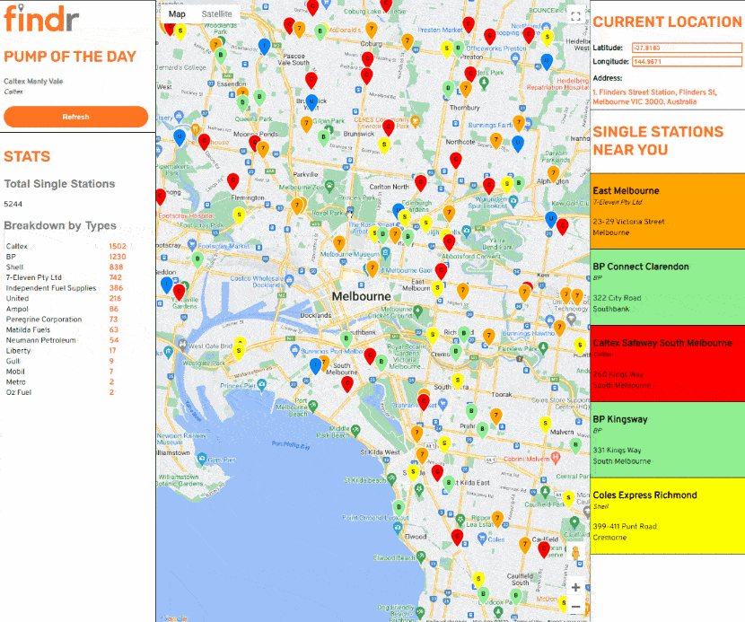

# Findr - Petrol Station Finder

Findr is an Australian-based petrol station finder with a dating app theme. Findr shows you petrol stations within the map viewport and locates the 5 nearest petrol stations from your location.

## Demo



## Features

- **Single stations near you**: Shows 5 nearest petrol stations from your location, which self-updates if location changes
- **Current Location**: Shows the current address, latitude and longitude, which self-updates when location changes
- **Markers**: Markers shows the locations of the petrol stations and are color-coordinated and labeled based on the owner
- **Marker optimsation**: Markers are optimised to be added only if within map viewport, and deleted if otherwise
- **Pump of the day**: A spotlight that presents a random petrol station. Click on the name to be brought to the location of the petrol station
- **Stats**: Displays the total number of petrol station and a breakdown by owner

## Getting started

These instructions will get you a copy of the project up and running on your local machine for development and testing purposes.

## Installing

_Note: You need to have [Node.js](https://nodejs.dev/) installed._

1. Get a Google API Key at https://console.cloud.google.com/apis/credentials

2. Clone the repo

   ```
   git clone https://github.com/gkken/findr
   ```

3. Install dependancies

   ```
   npm install
   ```

4. Enter your API key in index.html
   ```html
   <script
     src="https://maps.googleapis.com/maps/api/js?key=[ENTER_API_KEY]&callback=initMap&v=weekly"
     defer
   ></script>
   ```

## Built with

- [Node.js](https://nodejs.dev/)
- [Express.js](https://expressjs.com/) - Backend framework
- [node-postgres](https://github.com/brianc/node-postgres) - PostgreSQL client for Node.js
- Google Maps API

## Acknowledgements

Thank you to my fellow teammates for their contribution to the codebase:

- Aiching
- Edmund
- Foongyuan
- Nuraiman
